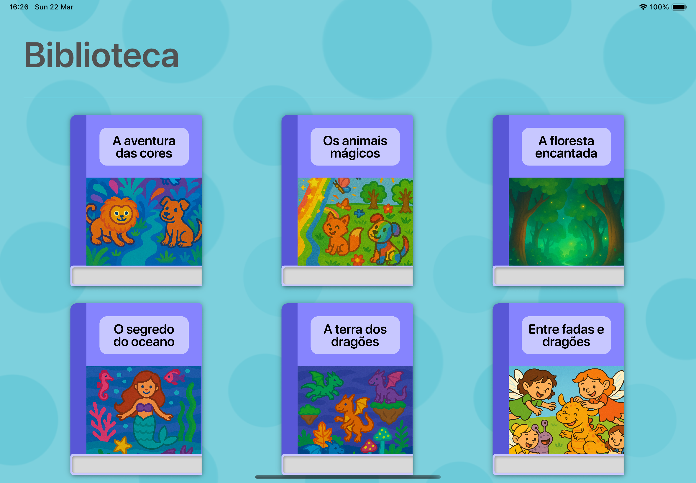
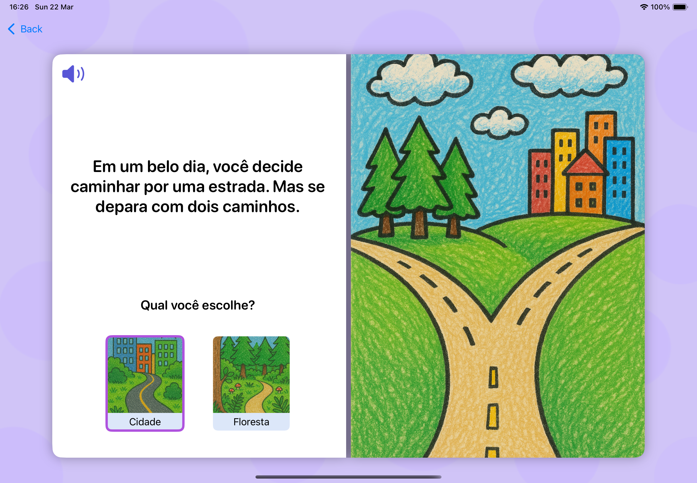
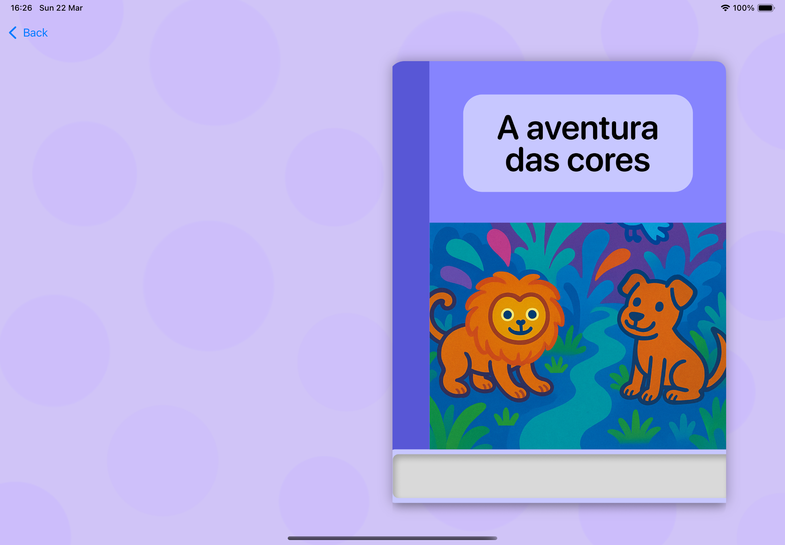

# Lalalendo

---

## 📚 Sobre o Projeto

O **Lalalendo** é um aplicativo de leitura interativa para crianças, desenvolvido com o objetivo de tornar a experiência de leitura mais **divertida, dinâmica e envolvente**.

Este projeto foi criado durante o terceiro challenge do **Apple Developer Academy**, sendo o meu terceiro projeto dentro do programa.

---

## 🖼️ Preview do App

---

## ✨ Features

- 📖 Narrativa interativa que se adapta às escolhas do usuário
- 🎧 Suporte a VoiceOver para acessibilidade
- 🎨 Interface amigável, intuitiva e visualmente atrativa
- 🧩 Estímulo ao engajamento e à progressão na leitura

---

## 🛠️ Tecnologias Utilizadas

- 🟣 **Swift**
- 🟣 **SwiftUI**
- 🟣 **UIKit**

---

## 👥 Equipe

Este projeto foi desenvolvido em colaboração com:

- Camille Luppi  
- Gabriel Gardini  
- Jordana Santos  
- Sofia Valverde  

---

## 🔗 Repositório

