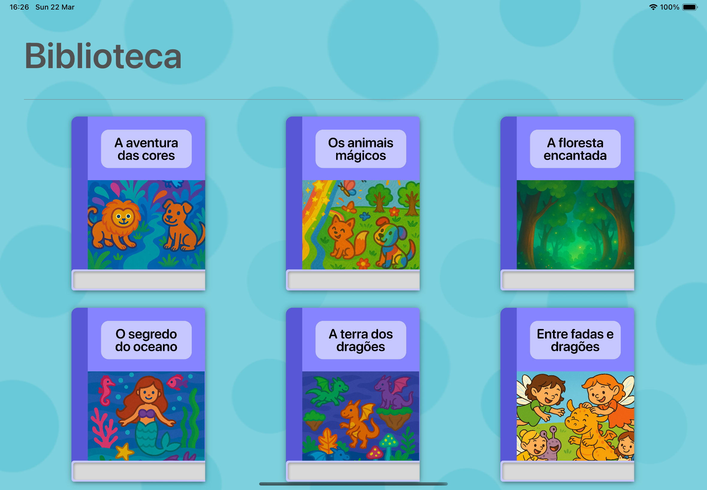
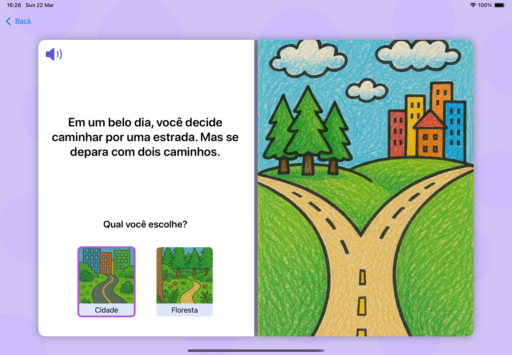
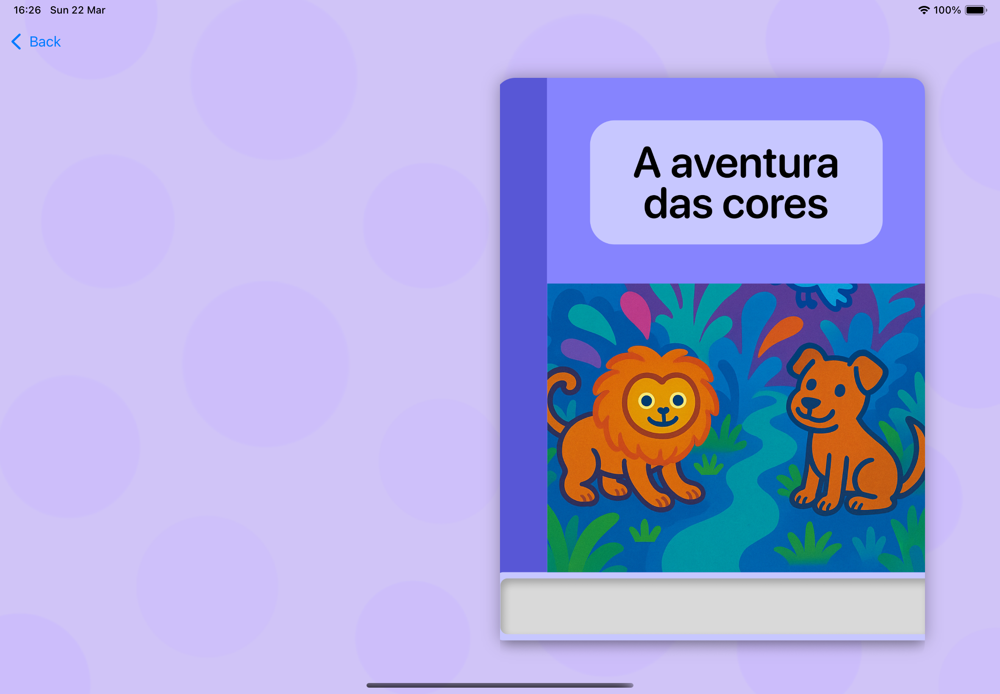

# Lalalendo

### Uma experiência de leitura interativa que torna ler mais divertido para as crianças.

---

## 📱 Sobre o App

O **Lalalendo** é um aplicativo de leitura interativa para crianças, desenvolvido com o objetivo de tornar a experiência de leitura mais **divertida, dinâmica e envolvente**.

Foi criado durante o terceiro challenge do **Apple Developer Academy**, sendo o terceiro projeto dentro do programa.

---

## ⚙️ Como Funciona

| 📖 Abra | 🎧 Leia | 🧩 Escolha |
|:---:|:---:|:---:|
| Entre na história e comece a leitura | Acompanhe a narrativa, com apoio de VoiceOver | Faça suas escolhas e veja a história se adaptar |

---

## ✨ Funcionalidades

### 📖 Narrativa Interativa
Uma história que se adapta às escolhas do usuário, tornando cada leitura única.

### 🎧 Acessibilidade
Suporte a VoiceOver, garantindo que a experiência seja inclusiva para todas as crianças.

### 🎨 Interface Amigável
Visual intuitivo e atrativo, pensado para o público infantil.

### 🧩 Engajamento
Estímulo ao engajamento e à progressão na leitura de forma lúdica.

---

## 🖼️ Preview do App

  
  
  

---

## 🛠️ Tecnologias

| Camada | Stack |
|---|---|
| **Linguagem** | Swift |
| **Interface** | SwiftUI · UIKit |

---

## 👥 Equipe

Projeto desenvolvido em colaboração com:

- **Camille Luppi**
- **Gabriel Gardini**
- **Jordana Santos**
- **Sofia Valverde**
